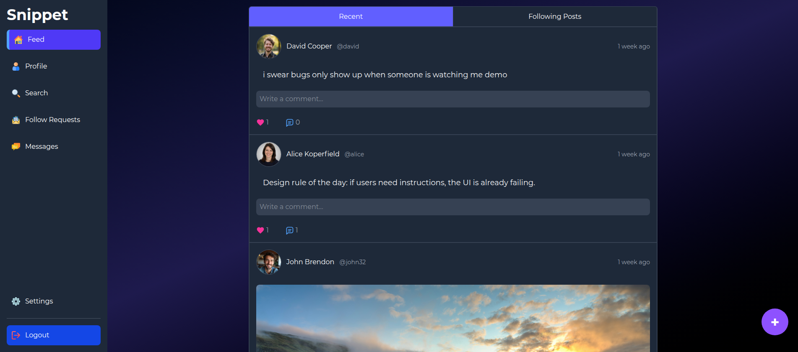
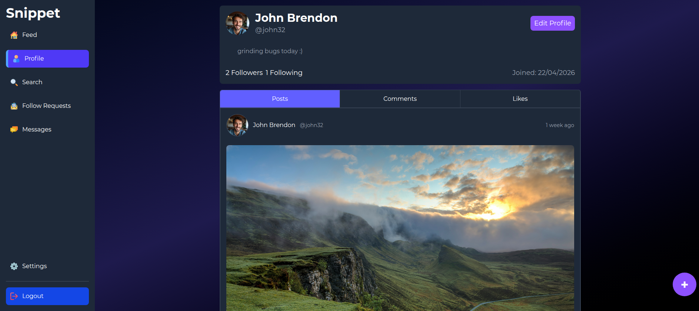
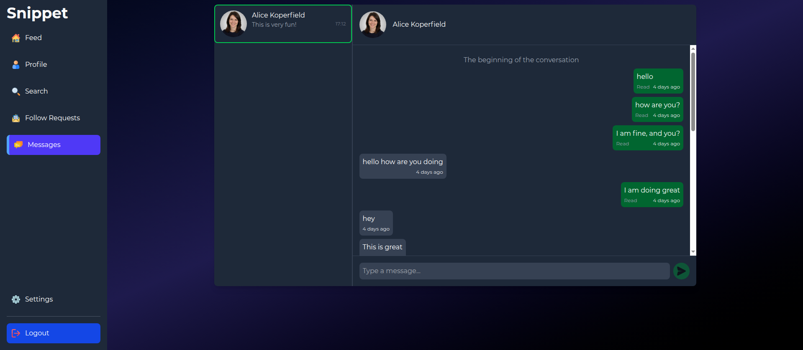

# Snippet

Live site: https://snippet.lat

Snippet is a full-stack social web application for sharing short posts, discovering people, following profiles, reacting to content, and chatting in real time. It is built with authentication, image uploads, Redis-backed caching and rate limiting, and a Socket.IO messaging system.

Users can create a profile, publish text or image snippets, browse a personalized feed, search for people and posts, comment, like, manage follow requests, and continue conversations through private messages.


## Preview





## Highlights

- Full authentication flow with signup, login, logout, refresh tokens, email verification, and Google OAuth.
- Protected API routes using JWT access tokens and HTTP-only refresh cookies.
- Social feed with snippets, likes, comments, profiles, following, and follow requests.
- Real-time private messaging powered by Socket.IO.
- PostgreSQL data layer managed with Prisma migrations.
- Redis integration for API caching and rate limiting.
- Image upload support through Cloudinary.
- Email delivery support through Resend.
- Docker Compose setup for running the full stack locally.
- Backend integration tests with Jest and Supertest against a real test database.

## Tech Stack

### Frontend

- React
- Tailwind CSS
- TanStack Query


### Backend

- Node.js
- Express
- Prisma
- PostgreSQL
- Redis
- Socket.IO
- Passport
- JWT authentication
- Cloudinary
- Resend

## Features

- Create text and image snippets, then like and comment on posts.
- Browse a feed, search users and posts, and explore profiles.
- Send and manage follow requests.
- Chat in real time through WebSockets with persisted conversations.
- Benefit from Redis-backed caching and rate limiting for speed and resilience.
- Use secure auth flows with refresh tokens, email verification, and Google OAuth.

## Running Locally With Docker Compose

The easiest way to run the full application locally is with `compose.yaml`. It starts:

- Backend API on `http://localhost:3000`
- Frontend app on `http://localhost:5173`
- Prisma Studio support on `http://localhost:5555`
- PostgreSQL inside Docker
- Redis inside Docker

### 1. Create an environment file

Create a `.env` file in the project root:

```env
NODE_ENV=development
PORT=3000

FRONTEND_URL=http://localhost:5173
BACKEND_URL=http://localhost:3000
VITE_API_URL=http://localhost:3000

DATABASE_URL=postgresql://postgres:postgres@db:5432/snippet_db
REDIS_URL=redis://redis:6379

SECRET=replace_with_a_long_random_secret

CLOUDINARY_CLOUD_NAME=your_cloudinary_cloud_name
CLOUDINARY_API_KEY=your_cloudinary_api_key
CLOUDINARY_API_SECRET=your_cloudinary_api_secret

RESEND_API_KEY=your_resend_api_key

GOOGLE_CLIENT_ID=your_google_client_id
GOOGLE_CLIENT_SECRET=your_google_client_secret
```

The required basics are `DATABASE_URL`, `REDIS_URL`, `SECRET`, `FRONTEND_URL`, `BACKEND_URL`, and `VITE_API_URL`. Cloudinary, Resend, and Google OAuth are needed for uploads, email verification, and Google login.

### 2. Start the application

```bash
docker compose -f compose.yaml up --build
```

The backend container runs Prisma migrations automatically before starting the development server:

```bash
npx prisma migrate deploy && npm run dev
```

Once the containers are running, open:

```txt
http://localhost:5173
```

### 3. Stop the application

```bash
docker compose down
```

To stop the app and remove persisted database/cache volumes:

```bash
docker compose down -v
```

## Useful Docker Commands

Open Prisma Studio from the backend container:

```bash
docker exec -it snippet-backend npx prisma studio --port 5555 --browser none
```

Then visit:

```txt
http://localhost:5555
```

Reset the local database:

```bash
docker exec -it snippet-backend npx prisma migrate reset
```

View backend logs:

```bash
docker logs -f snippet-backend
```

View frontend logs:

```bash
docker logs -f snippet-frontend
```

## Testing

Backend tests use Jest and Supertest. They run against a separate test database and reset it automatically before the test suite.

```bash
cd backend
npm test
```

The backend test command runs:

```bash
npm run db:reset:test && jest
```
